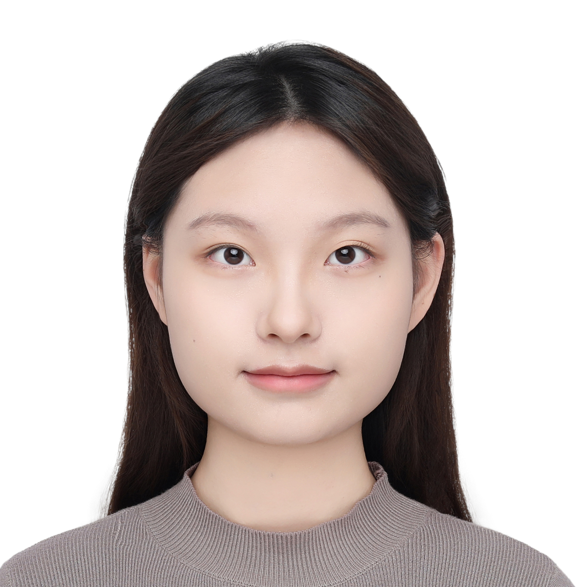

# 教学团队

## 教师

  
  

    <h3>李自达</h3>
    
zidali AT szu.edu.cn

    
<strong>职位</strong>&nbsp;&nbsp;&nbsp;&nbsp;生物医学工程学院副教授

    
<strong>研究</strong>&nbsp;&nbsp;&nbsp;&nbsp;体外诊断新方法、单细胞测序分析技术

     
    <a href="https://zidalab.github.io/zidali/" class="btn" style="border: 1px solid #ccc; padding: 5px 10px; text-decoration: none; color: #333; border-radius: 5px;">了解更多</a>
  

## 助教

  
  

    <h3>杨婧文</h3>
    
2907899609 AT qq.com

    
生物医学工程学院大三学生

  

